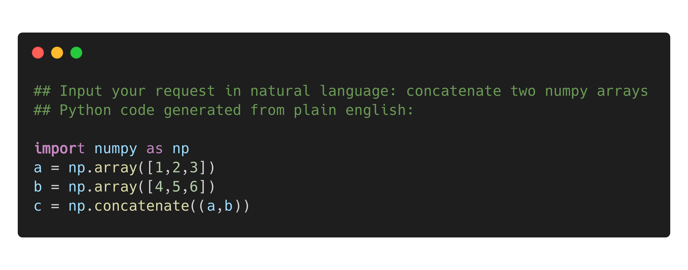

<h1 align="center">🗣 english2python 🧑‍💻 </h1>

<p align="center">
    OpenAI Codex Natural Language to Python Code Snippet Generator
</p>

## Why?
Remembering the correct syntax of every Python package can be very annoying and time consuming. Often you need to Google for simple commands like "How to concatenate two numpy arrays?" or "How to group entries of pandas df with same birthdate?"

Well now you can just keep a terminal up and running, prompt your request in natural english and voilà ⚡️ : a code snippet written in Python.

## How it works
Reads a string from the command line in natural language and creates an input prompt which is then fed to OpenAI Codex to generate the corresponding code snippet in Python.

To generate your own files you need to get access to the Codex API (https://openai.com/blog/openai-codex/).
## Installation
```bash
git clone https://github.com/alxschwrz/codex_english2python.git
cd codex_english2python
pip3 install -r requirements.txt
```

## Example
```bash
python3 english2python.py
```


... exit the program by typing 'exit()' + Enter

## Credits
This project is based on the OpenAI Codex project.

